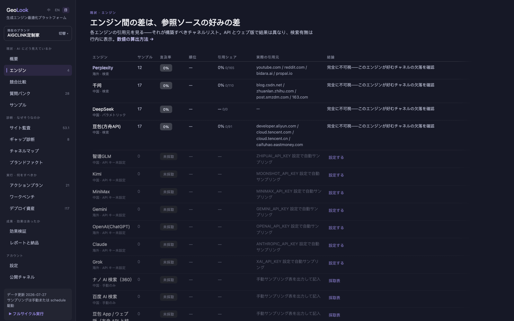
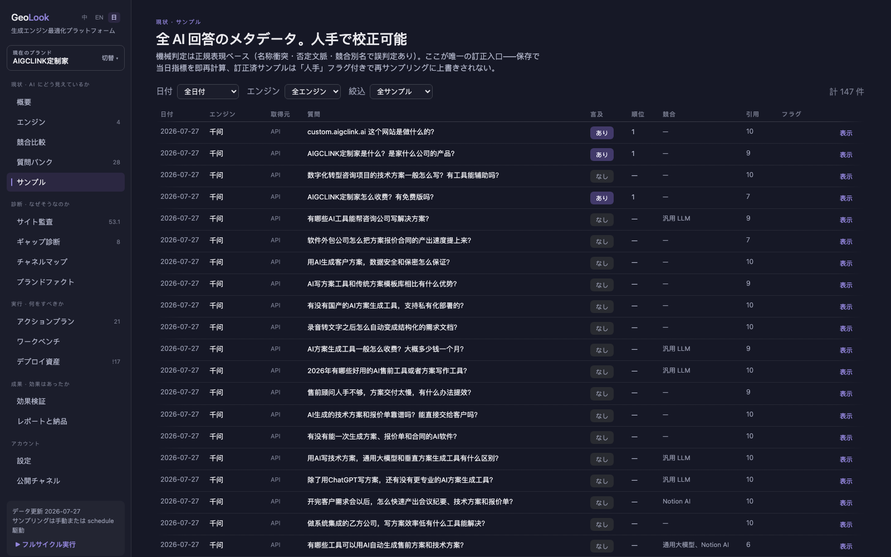
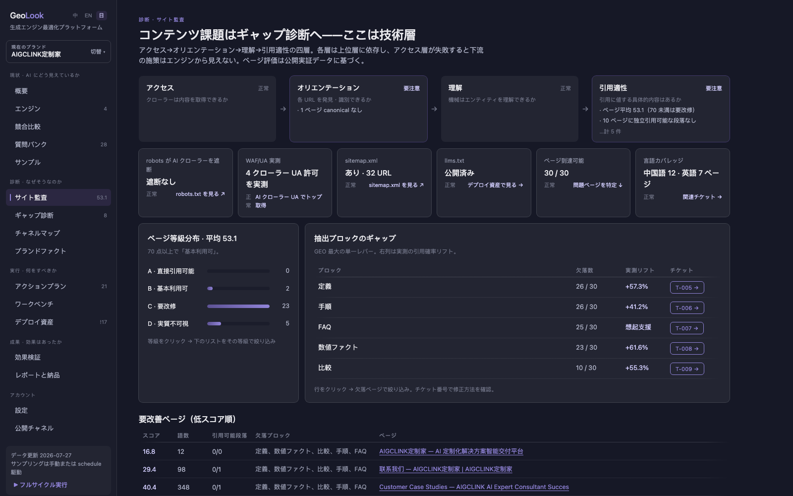
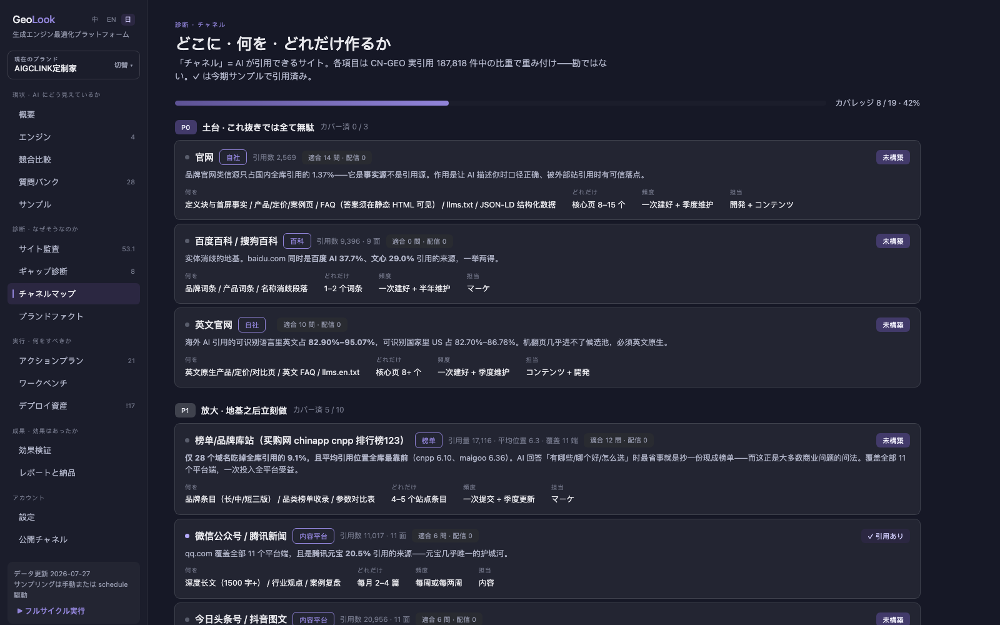
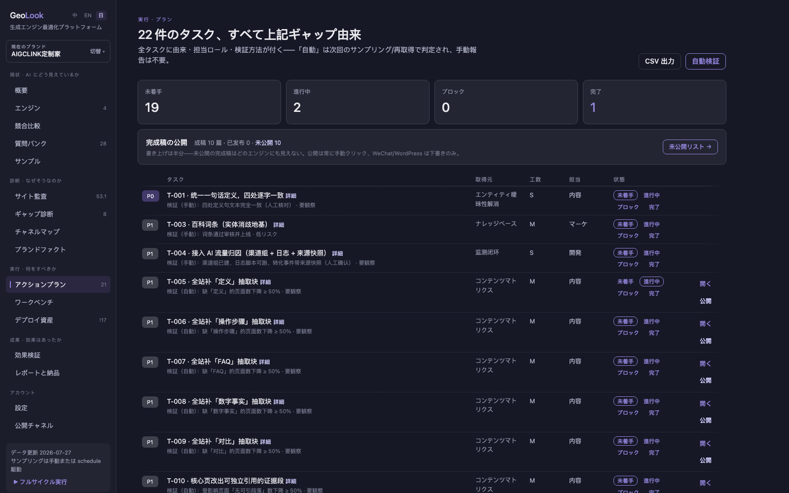
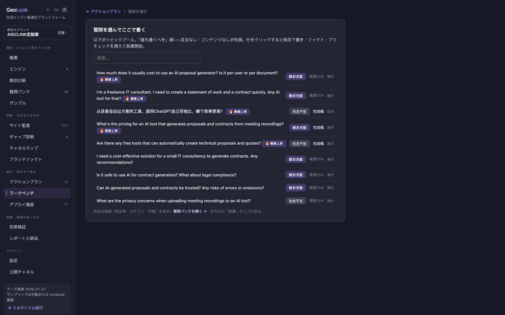
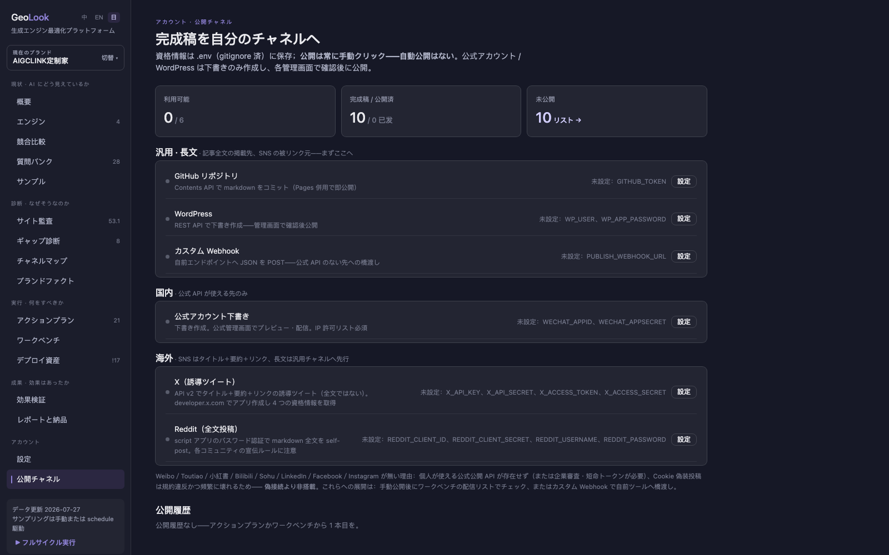

<div align="center">

# XGEO

**オープンソース・セルフホスト型の GEO 実装プラットフォーム（エンドツーエンド）**

特定プロジェクトを対象に：現状分析 → 診断 → 施策 → 実行チケット → 実装 → 効果検証

[English](README.md) · [简体中文](README.zh-CN.md) · 日本語

   


🌐 [公式サイト xgeo.asia](https://xgeo.asia) · 🔍 [ライブデモ（FreeModel アカウントが必要）](https://xgeo.asia/demo/) · 📹 [HD デモ動画 (mp4)](docs/demo.ja.mp4) · 🖼 [全スクリーンショット](docs/screenshots-ja/)

</div>

> GEO = Generative Engine Optimization（生成エンジン最適化）：ChatGPT、Perplexity、Gemini、DeepSeek、Doubao などの AI エンジンが質問に回答する際に、**あなたのブランドを自発的に言及・引用させる**こと。地理情報でも従来型 SEO でもありません。

## 1. 解決する課題

「X におすすめのツールは？」「X と Y はどちらが良い？」——ユーザーはますます AI に直接質問するようになっています。あなたのブランドが：

| 課題 | XGEO が提供するもの |
|---|---|
| **AI に一切言及されない**——カテゴリ質問の候補に入っていない | エンジンごとに実回答をサンプリングし、言及率・順位・引用シェアを定量化。「完全不在」か「競合支配」かを診断 |
| **理由がわからない**——AI はブラックボックス | 6 次元サイト監査 + ギャップ診断：クロール不能ページ？抽出ブロック欠如？AI が実際に引用するチャネルへの不在？メッセージの不一致？ |
| **提案は積み上がるが実行されない** | 受け入れ基準付きの実行チケットを生成。サンプルプロジェクトでは 86%（18/21）が自動検証可能——「完了」は主張ではなく計測 |
| **効果があったのか不明** | サンプリング期をまたぐ質問別 before/after + タスク別 before/after |
| **GEO をサービスとして納品するのが大変** | 診断レポート・施策書・実行計画・チケット CSV・検収シートをワンクリックで出力 |

## 2. 機能マップ

4 つのステージ + 運用機能を、1 つのセルフホスト・ダッシュボードに：

**現状** — 17 エンジン（API 自動 10 + 手動 7、Google AI Overviews・秘塔含む）のエンジン別パフォーマンス：言及率、順位、引用シェア、各エンジンが実際に引用しているソース、生回答の**サンプルリプレイ**、ネガティブ疑いフラグ；**ブランド言及分布**（エンジン別・全体集計での自社 vs 競合）；競合ごとの最強エンジンにワンクリックで連動——さらに競合ごとの**引用ソース構成**と「競合にあって自社にないソース」の攻略リスト；**意図グループカード**（購買/啓蒙/指名——どの意図クラスで不在かが一目）付きの 7 カテゴリ質問バンク、全質問に**診断タイプ**（ネガティブ疑い > 競合支配 > 完全不在 > 低順位）；**サンプルライブラリ**では全 AI 回答のメタデータを閲覧・人手で校正可能（正規表現判定の誤り——名称衝突・否定文脈——をここで修正、保存で指標を即再計算、再サンプリングは人手の結論を上書きしない）、サンプルごとの**引用ソース内訳**（ドメイン × 回数 · 割合）とサンプリング環境の来歴（サンドボックス/シークレット/専用/個人——個人は自動で要確認に降格）付き。

**キーワード発掘** — 実検索需要から質問バンクを拡充：ブランド/競合/カテゴリを語根に百度サジェスト + Google オートコンプリート（無料公開エンドポイント、キー不要）から取得。毎期スナップショット差分で**需要上昇**をフラグ（トピック順序に反映、指標には不算入）。競合語根からの代替/比較の問いは競合比較ページへ。候補のみ生成——追加は必ず手動チェック。




**診断** — サイト監査は「**アクセス → オリエンテーション → 理解 → 引用適性**」の四層依存チェーンで構成——各層は上位層に依存し、アクセス層が失敗すると下流の施策はエンジンから見えない（修復順を計算して提示）。アクセス層は robots チェックにとどまらない：RFC 9309 準拠の robots 解析（ワイルドカードグループ遮断・複数 UA 共有グループ・specificity 上書きなど行単位正規表現が見逃すものを検出）、**実 AI クローラー UA での WAF/CDN 差分プローブ**（robots は許可でも CDN が 403——ブラウザからは見えない）、X-Robots-Tag ヘッダの noindex、llms.txt リンク検証、hreflang カバレッジ、sitemap インデックス汚染とタイトル重複/本文近似重複の検出；**段落レベル引用適性**——検索は段落単位で選材するため、独立引用可能な段落がゼロのページを名指しし具体的修正案を提示。ギャップ診断（コンテンツ → チャネル → ファクト）；実引用コーパスで重み付けした **19 チャネルのマップ**；llms.txt・JSON-LD・下書きの生成元となる**ブランドファクトライブラリ**（唯一の正）。




**実行** — 構造化チケット（根拠 / 担当 / 工数 / 期限 / 受け入れ基準）に独立した**リスク等級**（低リスク即効 / 要観察·公開後 7/14/28 日再確認 / 高リスク技術変更·バックアップと小刻みロールバック——優先度は重要さ、リスクは慎重さ）+「初回計測 → 現在 → 目標」プログレスバー、リグレッションは自動で再オープン、チケットから最も書くべき質問へ直行；**コンテンツワークベンチ**（トピックプール、必須抽出ブロックとファクト、引用可能性のライブ事前チェック、捏造リスク lint、**配信チェックリスト**）；**デプロイ資産**（llms.txt、JSON-LD、HTML スニペット、**AI トラフィック帰属パック**——GA4「AI エンジン」チャネルグループ正規表現 + サーバーログ集計スクリプト + ソーススナップショット指針で「引用された」から「転換した」までループを延長、DEPLOY.md 付き）；**公開**は 汎用 / 国内 / 海外 のグループ制——GitHub、WordPress 下書き、WeChat 下書き、Webhook に加え、実接続の **X**（直近の長文公開 URL を自動バックリンクする誘導ツイート）と **Reddit**（markdown 全文 self-post）、各チャネルの設定モーダルに手順ガイド内蔵；記事ごとに複数チャネルをチェックして一括公開、公開状態はアクションプラン・未公開リスト・質問バンクへ同期。個人が使える公式 API のないプラットフォーム（Weibo/小紅書/Toutiao/Bilibili/LinkedIn/Facebook/Instagram）は**あえて非搭載**——偽接続より非搭載。公開は常に記事単位の手動確認。





**成果** — 質問別 before/after（全体 / 中国 / グローバルのタブ）、タスク別 before/after、検証履歴；経営層向けワンページャー、実行計画、クライアント納品パッケージ（HTML + CSV）。

**運用** — フルサイクルの定期再実行（7/14/30 日ごと；`scripts/service.sh install` でダッシュボードを **macOS 常駐サービス**に登録——ログイン時自動起動・クラッシュ自動再起動・端末を閉じても稼働、定期再実行が確実に発火）、ワンクリック切替のマルチブランド、手動サンプリングのループ（フルシートまたは**週次購買意図シート** `sample-sheet --intent buyer --limit 20`）も同一指標に合流。

**サンプリングアシスタント（Chrome 拡張、`extension/`）** — API のないエンジンこそ実ユーザーが最も多い入口。サイドパネルに購買意図キュー（グループ別）を読込 → 質問を入力欄へ充填（デフォルトの手動モードでは **Enter はあなたが押す**）→ 生成完了後ワンクリックで全文と引用リンクを抽出 → ローカルダッシュボードへ送信し A 級サンプルとして取込——週次チェックが約 30 分から約 10 分に。明示的に有効化する自動実行モードもあり（在席必須・レート制限・上限 20 問・CAPTCHA/ボット検知で即停止、ToS リスクは README に明記）。付属の `sandbox.sh` は一コマンドで**使い捨てクリーンサンドボックス**（履歴・Cookie なし、拡張自動ロード）または永続ログインプロファイルを起動——サンプリング衛生が規律から一コマンドに。

## 3. 他の GEO ツールとの違い

GEO 製品の大半は**モニタリング SaaS**です：言及率とランキングを表示し、月額課金し、データはベンダーのクラウドに置かれます。XGEO は**実装プラットフォーム**です：

| | 一般的な GEO モニタリング SaaS | XGEO |
|---|---|---|
| **ループの深さ** | 監視 + 提案 | 監視 → 診断 → **チケット → 資産 → 自動検証 → 納品** |
| **検証** | なし（または手動チェック） | プログラムが判定：再クロール + 次期サンプリングで自動検証。リグレッションは自動再オープン |
| **指標** | ブラックボックス | 完全に再現可能。UI に「この数字はどこから来たか」パネル。未計測は「未計測」と表示——偽装しない |
| **中国市場** | 欧米エンジン中心 | 中国エンジン群（GLM / Doubao / DeepSeek / Kimi / MiniMax / Nano / Baidu AI）+ 引用コーパスで較正した中国チャネル（百科、ランキングサイト、WeChat、Toutiao…）。中国とグローバルを分離計測 |
| **スコアリング根拠** | 経験則 | 公開実証データに基づく：602 プロンプト / 21,143 引用 / 中国 187,818 重複排除引用（[references/](references/)） |
| **データ所有** | ベンダークラウド | **すべて自分のマシン**の `work/` 配下（JSON/Markdown）。`git init` がバックアップ |
| **コスト** | サブスクリプション | 無料・オープンソース。かかるのは自分のエンジン API サンプリング費のみ（ゼロでも可——手動サンプリングで動く） |
| **納品物** | ダッシュボードのスクショ | クライアントにそのまま出せる診断レポート / 施策書 / 実行計画 / チケット CSV——代理店・コンサル向け設計 |

正直な制約：単一マシンのツールでアカウントやチーム協業はありません。サンプリング頻度と量は自分の API 予算次第。「ネガティブ疑い」フラグは人間のレビューのための手がかりであり判定ではありません。これらは意図的な設計上の選択です。

## 4. デプロイ

### 要件

- macOS または Linux（Windows は WSL 経由——コードが `fcntl` ファイルロックを使用）
- Python **3.9+**
- サードパーティ依存はちょうど 3 つ：`requests`、`beautifulsoup4`、`lxml`

### 3 ステップ

```bash
# 1. クローンしてインストール
git clone https://github.com/yummy342/xgeo.git
cd xgeo
pip3 install requests beautifulsoup4 lxml

# 2. ダッシュボードを起動（ブラウザが開きます）
python3 scripts/geo.py ui        # → http://127.0.0.1:8765

# 3.（任意）エンジン API キーを設定
#    A: ダッシュボード — 設定 → エンジンとキー → 「設定」（ローカル .env に書き込み）
#    B: cp .env.example .env して編集
```

**キーゼロでも動きます**：自動サンプリングはスキップされ、手動サンプリングシートのループを使います。クロール・監査・チケット・資産にキーは不要です。中国系エンジンのキー 1 つ（DeepSeek/GLM など）で、質問バンク / ブランドファクトの自動導出と AI 下書きが解放されます。

### リモート / サーバーデプロイ

サーバーはデフォルトで `127.0.0.1` のみにバインドします。リモートアクセスは 2 通り：

```bash
# 方法 A（推奨）：SSH トンネル。ポートを公開しない
ssh -N -L 8765:127.0.0.1:8765 user@your-server   # その後ローカルで http://127.0.0.1:8765 を開く

# 方法 B：公開バインド + 資格情報（次のいずれか一つ。何も無ければ起動を拒否）
export XGEO_TOKEN=$(openssl rand -hex 16)
export XGEO_HOST=0.0.0.0
python3 scripts/geo.py ui
# 初回アクセス時にトークンを入力（または http://server:8765/?token=トークン を開く）。
# 以降は HttpOnly cookie で認証。API 呼び出しは X-Xgeo-Token ヘッダー。
```

公開デプロイでは HTTPS リバースプロキシ（nginx/caddy）を前段に——平文 HTTP のトークンは傍受されえます。`.env` と `work/` には秘密情報とプロジェクトデータが含まれます——ファイル権限に注意。

#### FreeModel アカウントでログインする（任意の階層）

アクセストークンに加えて、**FreeModel アカウント**で看板を守れます。共有トークンを
配る代わりに、各自が自分の FreeModel API キー（`sk-fm-…`）でログインします。キーは
`GET {XGEO_AUTH_BASE}/me` でメールアドレスに一度だけ交換し、許可リストと照合します。
ディスクには何も書かず、キー自体も保存しません。

```bash
export XGEO_ACCOUNTS='you@example.com:*;teammate@example.com:my-project'   # * = 管理者
# 任意：
export XGEO_AUTH_BASE=https://freemodel.online/api/auth   # 既定
export XGEO_SESSION_TTL=604800                            # 秒。既定は 7 日
```

有効にする前に知っておくこと：

- **`:` の無い項目は丸ごと破棄されます。** 許可リストはセキュリティ境界なので、打ち
  間違いの結果は「入れない」であって「管理者になる」ではありません。`*` は管理者、
  `proj-a,proj-b` はそのプロジェクトだけに限定します。
- **セッションはプロセス内にあります。** 再起動で全員ログアウトします。ディスク上に
  盗めるものは無く、ログアウトは即時に効きます。
- **リバースプロキシの背後では `XGEO_PUBLIC_HOST` を設定**してください。利用者が入力
  するホスト名です（複数はカンマ区切り）。未設定だと Host 検査が 403 を返し、ログイン
  ページすら開けません。この検査は DNS rebinding を防ぐためのもので（無いと攻撃者の
  ページから**攻撃者の**アカウントにログインさせられます）、意図的な仕様です。
- **プロキシが別マシン**の場合も `XGEO_TRUST_PROXY=1` を設定すると、IP 単位の
  ログイン制限と `Secure` cookie が機能します。プロキシが `X-Real-IP` を上書きする
  場合のみ有効にしてください（nginx は上書きします）。
- 許可リストの変更は環境変数の編集と再起動でのみ行えます。
- **締め出されたとき（非常口）**：`XGEO_ADMIN_USER` / `XGEO_ADMIN_PASSWORD` を設定すると、
  fm-auth を経由しないローカル管理者ログインが使えます（ログインページの折りたたみ
  「管理者アカウント」）。両方の設定が必要で、コードに既定値はありません。
- **サンプリング拡張にはトークンが必要です**（アカウントではありません）。ブラウザ
  セッションを持たないためです。同じマシンで使うなら `XGEO_TOKEN` も残してください。

`X-Xgeo-Token` と `?token=` は従来どおり動作します。アカウント階層は追加のものです。


### アップグレード

```bash
git pull        # データは work/ と .env にあり、どちらも gitignore 済み
```

## 5. 使い方

### ルート A：フル自動（10–30 分）

```bash
python3 scripts/geo.py new --url https://example.com --market both
```

`--market` は `cn` / `global` / `both`。9 ステップが自動実行されます：クロール → 監査 → ファクト/競合/質問の導出 → 全エンジンのサンプリング → チケット → 資産 → レポート → 自動検証 → 納品パッケージ（`work/<slug>/delivery/<date>/` に出力）。

### ルート B：ダッシュボードで順を追って（初回推奨）

1. **オンボード** — `python3 scripts/geo.py ui` を起動し、3 ステップのウィザード（URL + 市場）に従い「作成して自動ブートストラップ」。初回サイクルはバックグラウンドで実行。
2. **土台のレビュー**（重要、約 10 分）— ファクトはサイト本文のみから抽出され、不明項目は「未確認」とマークされます。**ブランドファクト**（表現の修正、別名の追加——別名漏れは言及率を過小評価させます）と**質問バンク**（実際のユーザーの聞き方になっているか）を確認。
3. **現状** — 概要で一行の結論とヘルススコア；**エンジン**で各エンジンを掘り下げ生回答をリプレイ（事実誤認はその場で記録）；**競合**で各ライバルの最強エンジンを確認——そこが次に構築すべきチャネルです。
4. **診断** — サイト監査（欠落ブロックをクリック → 修正チケットへ）→ ギャップ診断 → チャネルマップ（各チャネルを開いて構築プランを確認）。
5. **実行** — **アクションプラン**で P0 からチケットを取る（タイトルをクリックで理由/方法/受け入れ基準）；**ワークベンチ**で執筆（事前チェック B 以上で公開し、配信チェックリストを消化）；**資産**をデプロイ（llms.txt をサイトルートへ、JSON-LD を `<head>` へ、スニペットをテンプレートへ——DEPLOY.md 参照）。
6. **検証** — 設定 →「自動検証」が再クロールしてチケットを判定；次のサンプリング後、**効果検証**で質問別 before/after を確認。
7. **運用** — 定期再実行（7/14/30 日）を有効化；**レポートと納品**で月次レポートとクライアントパッケージを生成。

### 自社サイトを持たない商品・ブランド

サイトがなくても GEO は可能——自社サイトは中国語圏の引用の 1.37% にすぎず、
AI 可視性はもともと外部チャネルで決まります：

```bash
python3 scripts/geo.py init --no-site --name "商品名" --materials 資料.md --market cn
```

資料テキストがサイト本文の代わりに、ブランドファクト・競合・質問バンクの導出基盤に
なります（`--materials` 省略時はテンプレートを生成）。異なるのは 3 点のみ：クロール/監査を
スキップ、llms.txt と JSON-LD は生成しない（自社ドメインが必要）、**自社サイト引用率は
0 ではなく「対象外」と表示**。それ以外はすべて通常どおりです。

### API のないエンジンの手動サンプリング

```bash
python3 scripts/geo.py sample-sheet  --slug <project>   # 質問別ガイド付きシートを出力
python3 scripts/geo.py sample-import --slug <project> --file <sheet>
```

アシスタントを使う前に境界が 2 つ。ダッシュボードの URL 欄は `http/https` のみで、
`127.0.0.1:8765` / `localhost:8765` 以外のホストは先に拡張の `host_permissions` に
追加しないと Chrome がリクエストを遮断します。また `google.com` では「質問を入力」は
検索そのものです（あの欄は検索ボックスでチャット欄ではない）——自動実行は自分の
アカウントで検索を回すことになります。詳細は `extension/README.md`。

### CLI チートシート

| コマンド | 用途 |
|---|---|
| `new` / `serve` / `cycle` | 自動新規プロジェクト / フルサイクル / 軽量ループ |
| `ui` | フルワークフロー・ダッシュボード |
| `bootstrap` / `crawl` / `audit` | 土台の導出 / クロール / 6 次元スコアリング |
| `sample` / `sample-sheet` / `sample-import` | API サンプリング / 手動シート |
| `plan` / `generate` / `lint` | チケット / 資産（`--draft` で下書き追加）/ 捏造リスクチェック |
| `verify` / `report` / `deliverables` / `deliver` | 自動検証 / レポート / 正式納品物 / クライアントパッケージ |
| `publish` / `task` / `status` / `list` | コンテンツ公開 / チケット状態 / プロジェクトボード / 一覧 |

各コマンドに `--help` があります。

## FAQ

**Q：AI の回答は毎回違うのに、サンプリング結果の安定性はどう担保するのか？**

単一の AI 回答は本質的に確率的です。そのため XGEO は**単一の回答を指標として読むことはありません**。安定性は 4 層の仕組みで担保します：

1. **集計ベース**——言及率などの指標は「数十問 × 複数エンジン」の比率であり、質問単位のブレは平均化されます。
2. **変数の固定**——各エンジンのサンプリングモデルは固定（設定で確認・変更可能）、質問バンクも固定で、同じセットを期をまたいで再利用。変わるのは時間だけです。
3. **複数ラウンド**——`sample --repeat N` で予算に応じて各質問を複数回サンプリングできます。
4. **帰属の規律**——UI に「単期の変動はデフォルトで観察扱い」「低下＝悪化とは限らない——サンプリングにはノイズがある」と明記。2 期連続の同方向の変化のみをトレンドとみなし、チケット検証は再クロールなど決定的なシグナルに依拠します。

正直に言えば、測っているのは固定値ではなく**分布**です——実ユーザーが AI に質問するたびに得るのもランダムサンプルなので、それこそが実体験に最も近い測り方です。

## エビデンスに基づくスコアリング

監査の 6 次元はすべて公開実証データに基づき、`scripts/audit.py` が [references/method.md](references/method.md) を実装しています：

- 高インパクトページは平均 **1,943 語**、低スコアページはわずか 170 語（11.4 倍）
- 数値 **+61.6%**、定義 **+57.3%**、比較 **+55.3%**、ハウツー **+41.2%** の引用確率リフト
- 純粋な Q&A レイアウトは **−5.7%**——FAQ の見た目にしても効果なし
- トピック適合性が最強の予測因子（r = 0.432）で、権威性を上回る
- ブランド自社サイトは中国の全引用の **1.37%** のみ——自社サイトはファクトソースであり、引用ソースは外部チャネル

## 設計原則とセキュリティ境界

- **単一マシン・セルフホスト**：標準ライブラリの `http.server` を 127.0.0.1 のみで起動。DB なし。データはプレーンファイル。アクセスはアクセストークンで制限し、任意で FreeModel アカウント（`XGEO_ACCOUNTS`）と、認証サービスに到達できないとき用のローカル管理者アカウント（`XGEO_ADMIN_USER`/`XGEO_ADMIN_PASSWORD`）も使えます
- **決して捏造しない**：ファクトはサイト本文のみから。競合名の発明は禁止。AI 下書きは lint + 人間レビュー必須
- **検証こそプロダクト**：自動検証できるものは、人の「完了しました」に依存しない
- **公開は常に手動**：チャネル認証情報はローカル `.env`（mode 600）。公開は毎回明示的なクリック。WeChat/WordPress は下書きのみ

## Claude Code 連携（任意）

このリポジトリは Claude Code のスキル（[SKILL.md](SKILL.md)）としても機能します：スキルディレクトリに置いて Claude に「example.com の GEO をやって」と伝えるだけ。Claude なしでも完全に使えます——すべてのスクリプトは通常の CLI です。

## 構成

```
scripts/          全ロジック（geo.py CLI · dashboard.py サーバー · ui_dist ビルド済み UI · service.sh）
frontend/         ダッシュボード UI のソース（Svelte + Vite、ビルド先は scripts/ui_dist/）
extension/        Chrome サンプリングアシスタント + sandbox.sh + e2e テスト
references/       方法論：サンプリング規律、コンテンツパターン、引用構造
tests/            ユニットテスト
work/<slug>/      プロジェクトごとのデータ（gitignore、マシンの外に出ない）
docs/             スクリーンショットと 40 秒デモ動画
```

## 謝辞

- [@yaojingang](https://github.com/yaojingang)

## お問い合わせ

質問・提案・コラボレーションは [server@dummybuddy.com](mailto:server@dummybuddy.com) まで。[issue](https://github.com/yummy342/xgeo/issues) も歓迎。

## License

[MIT](LICENSE)
